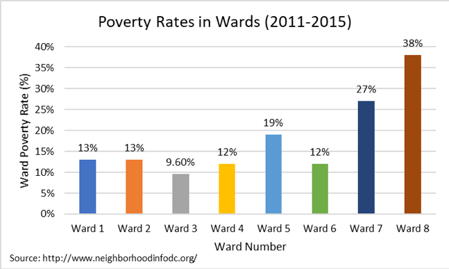
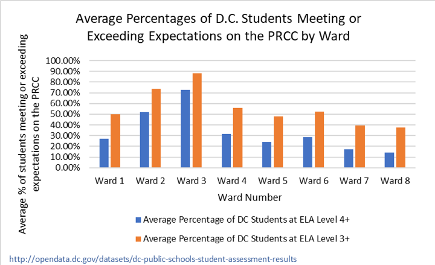

With huge achievement gaps between schools and on average more than half of all students failing to meet literacy expectations on standardized tests, the D.C. public school system (DCPS) is struggling to get elementary school students reading at grade level. Despite improvements in literacy rates over time, low English language arts achievement persists. The numbers draw troubling connections between where a child grows up, the school they attend, and their future success. 

Experts say that fourth grade is the benchmark age at which students should be reading at grade level. However, according to the National Assessment of Educational Progress, “only about one-third of our nation’s fourth graders can read proficiently.” The numbers become more distressing in impoverished areas where the NAEP says only “20 percent of low-income students are reading proficiently” at this same age. 

In Washington, students’ reading, and math abilities are evaluated by PARCC (Partnership for Assessment of Readiness for College and Careers) an annual assessment for students grades three through eight on Common Core standards. The test measures skills like problem solving, critical thinking, and evidence-based reading. 

Since PARCC’s first year, the number of students performing well on the reading section has risen incrementally, moving from 25 percent meeting or exceeding expectations in 2015 to 31 percent this past year. Yet, these increases may not mean much. According to Steven Bahr of the National Center for Education Statistics: “The average reading score for fourth-grade students in D.C. in 2017 was not significantly different from their average score in 2015 and was higher than the average score in 2002.” In 2002 the average literacy score in D.C. was 191, compared to the national average of 217, according to The Nation’s Report Card. Today, the average literacy score in D.C. is 213, compared to the national average of 221, a large increase from 2002. Bahr also added that “the average score of DCPS fourth-graders was not dissimilar to the average score for public school students in large cities” in 2017. Although DCPS is on par with other cities of its size, progress in literacy is not happening as quickly as people would like. Kaya Henderson, the former Chancellor of DC Public Schools at the time, called these results “sobering” considering the ways D.C. has left to go. 

Even though the percentages of students who are meeting or exceeding expectations is rising, the percentages of students at each respective proficiency level (1 being least proficient and 5 being most proficient) are staying relatively consistent, especially within the transitional reading levels: 2 and 3. Only Levels 4 and 1 appear to be undergoing somewhat significant shifts. This means students are moving out of the lowest level and into the highest achieving level, yet the majority of students are staying put in the “approaching expectations” categories. 

Scores do not vary much by age, but they do fluctuate greatly depending on race and socioeconomic status. Test scores reveal the ways in which these factors are intertwined and how a child’s privilege and circumstances dictate a lot about their academic success. PARCC scores from 2016 to 2017 show that the highest performing racial group in DCPS is white students by a wide margin, followed closely by children of mixed race, Asian Americans, Hawaiian, and Pacific Islander and American Indian and Alaskan Natives in the equal percentages, Hispanic students, and lowest scoring: Black Americans. These alarming numbers highlight large gaps of almost 60 percent disparity between white students and students of color.

The inequalities continue, as links between racial breakdowns and economic status are also reflected. The 2010 census of D.C. shows Wards 2, 3, and 4 are among the richest areas in the district with low poverty rates and average family incomes in the 100 and 200 thousand range. In contrast, Wards 7 and 8 have the highest rates of poverty (more than a quarter of their areas) and very low average family incomes hovering between 40 and 55 thousand, a sum often earned by one person per year. Wards 7 and 8’s black populations are also dominant, making up over 90 percent of these areas. While, richer Wards, although not entirely whitewashed, tend to have a sizeable portion of the population made up of white Americans. 

Not only do race and economic status go hand in hand, but PARCC percentages correlate with these factors. The greatest number of students reaching the upper levels for literacy fall in Wards 2, 3, and 4. In Ward 3 schools, over 70 percent of students exceed standards and roughly 88 percent meet standards for PARCC. In sharp contrast, in Ward 8 schools, 37 percent of students meet literacy standards and only 14 percent exceed them. Students in the poorest Wards by consequence are placed on an unequal playing field to their wealthier peers. 

If the disparities are not apparent enough, we must note that in some schools within Wards 7 and 8, hardly any students are meeting reading standards. Ward 8’s Simon Elementary School and Hendley Elementary School only had 2 percent and 4 percent of students meet or exceed expectations. Ward 7’s CW Harris Elementary and Smothers Elementary similarly have only 5 percent and 6 percent of their students meet or exceed standards in literacy on the PARCC. If over 95 percent of students are leaving these elementary schools without basic grade level reading skills, what does it mean for these student’s future success?

Doubly concerning, many of the District’s schools fall within the poorest Wards, whereas the richer Wards tend to have fewer public schools available. Wealthy Wards 2 and 3, each have only 10 public schools in total. On the other hand, Ward 7 has 32 schools for public use and Ward 8 has 35. Part of this can be explained by the increased availability of private and charter schools within certain parts of D.C. Still, what does this say that so many students are receiving their education from these poor areas that statistically perform poorly on standardized tests?   

Despite less than desirable results, all hope isn’t yet lost. New initiatives and efforts are being made with each passing year to reverse the effects of poor literacy education within some schools inside DCPS and spur future progress. For one, DCPS has launched the teacher education program: LEAP that stands for Learning Together to Advance our Practice at every school, in every classroom, according to their 2016 press release. The program serves to strengthen teacher skills in teaching Common Core concepts through weekly development meetings run by education professionals like principals and administrators. 

Reading Partners is another initiative attempting to tackle the tricky issue of low literacy with the help of its 11,422 community volunteers. Focusing on reading skills, the children’s literacy nonprofit has a sizeable reach, serving 19 schools across Wards within the DCPS system. Some D.C. partners include Ward 8’s Aiton Elementary School and Malcolm X Elementary School and Ward 4’s Dorothy I. Height Elementary. 

The students the program serves tend to be of lower income levels, measured by 92 percent of Reading Partners students being on free or reduced lunch programs. Almost a third of students who participate in a program are also English language learners. 

 With their help, Reading Partners boasts that “90 percent of K-2 students master key foundational reading skills needed to read at grade level” and “83 percent of all reading partner students met or exceeded their primary end of the year literacy goal” as of 2017. Katie Nicolle, a site Manager for Reading Partner’s Dorothy I. Height Elementary School, says it well when she explains: “we focus on doing one thing very well. We tutor Kindergarten through Fourth Graders, that are one month to two and half years behind in reading and are not qualified to receive other special reading services.” She goes on to say another “unquantified benefit from Reading Partners is the education it gives to our community members. Many of our tutors are voters or future voters in the community. They can witness the passion and drive of educators. They can see how systems of oppression have affected some students over others.”

 

The district, through its constant program revamping, clearly is putting in the work to get students where they need to be. The progress is slow, but educator, Katie Nicolle assures us “every year we work to get better at what we do. Education is so dynamic, and it requires educators to adapt, change, and improve. We are not complicit.”

