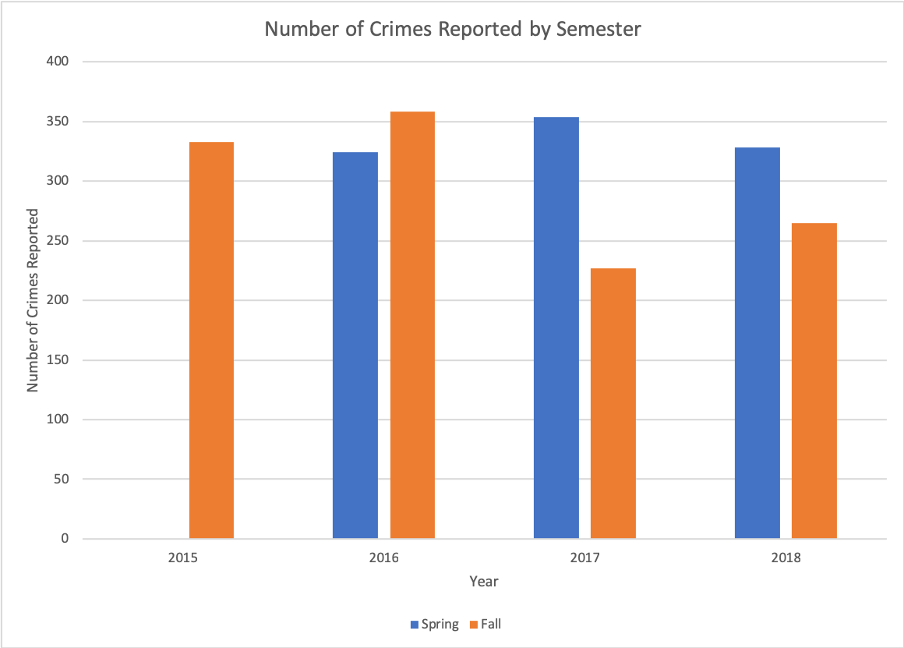

As required by law, American University provides crime statistics by releasing an annual security report and by updating a daily crime log that details violations happening on campus. 

From analyzing the data within the daily crime logs provided by the American University Police Department, it is evident that alcohol violations are the most common crime occurring on campus. In addition, even when adjusted for per capita rates, the residence halls have the highest level of crimes. Cases of sexual assault at American University increased in the wake of national coverage of the #MeToo movement. American University also has high rates of alcohol, drug, and sexual assault violations compared to other colleges within the D.C. area. 

With the #MeToo movement and the opioid epidemic happening on a national scale, and a [rise in bias-related incidents on college campuses](https://www.adl.org/resources/reports/2017-audit-of-anti-semitic-incidents), there has been increased scrutiny of the crime statistics for universities. At the same time, these logs and reports are not easily accessible. This is problematic when many American University students are unaware of the crimes taking place on and around campus.

*The Student Perspective on the General Trend of AU Crimes*

American University students believe that they live on a safe college campus. Jacob Louis, a sophomore, said that he felt safe most of the time and it only sometimes gets “weird at night.”  

The American University Police Department (AUPD) enforces safety on campus. It is composed of over [60 police officers](https://www.american.edu/police/), has over 600 cameras that survey the campus, and protects an undergraduate population of [more than 8,000 students](https://www.usnews.com/best-colleges/american-university-1434). 

In the analysis of the daily crime logs provided by the university, 2,531 crimes happened between July 10th, 2015 and March 31st, 2019. The average crime rate was less than one crime per day. This is consistent with students reporting that they felt safe on American University’s campus. 

In order to best understand the crimes that occur, it is necessary to view the general trend of crime rates over a full year. 

There were three full academic years reported: 2016, 2017, and 2018. Before the year 2015, the US Department of Education did not collect individual statistics for rape, fondling, incest, and statutory rape, so this article only includes the years 2015 through 2019. The year 2016 had the highest number of crimes with 796 violations in the course of one year. In these three years, there is a visible trend of crimes decreasing in July and then rising in August through October. This would coincide with students going home for the summer and then returning to American University for the fall semester. 

These are the number of crimes reported by semester. When looking at the data provided, the spring semester typically has a higher average crime rate than the fall semester. The spring has an average of 335 crimes while the fall has an average of 296 crimes. 

*The Crime Log Explanation*

Every calendar year, American University releases two different reports: the Annual Security Report and the daily crime log. [The American University Annual Security Report](https://www.american.edu/finance/publicsafety/upload/2017-Annual-Security[-Report.pdf) is a lengthy booklet that contains all information they must report to abide by the Jeanne Clery Disclosure of Campus Security Policy and Campus Crime Statistics Act] (https://ifap.ed.gov/eannouncements/attachments/HandbookforCampusSafetyandSecurityReporting.pdf) (also known as the Clery Act). This report is a general synopsis of crimes over a calendar year. 

The Clery Act is a federal statute that requires colleges and universities that receive federal financial aid programs to maintain and disclose crimes on campus. This act requires that colleges disclose specific crimes that are defined on the United States Department of Education website and report it to the federal agency. The crimes that must be reported and recorded include: murder/ non-negligent manslaughter, negligent manslaughter, rape, fondling, incest, statutory rape, robbery, aggravated assault, burglary, motor vehicle theft, arson, hate crimes, domestic violence, dating violence, stalking, weapon possession, drug abuse violations, and liquor law violations. Domestic violence, dating violence, and stalking are all under a subcategory called VAWA offenses. Under the [Hierarchy Rule](https://ifap.ed.gov/eannouncements/attachments/HandbookforCampusSafetyandSecurityReporting.pdf) within the guidelines of the Clery Act, if more than one criminal offense was committed during a single incident, the institution only counts the most severe offense. 

The daily crime log provides detailed statistics of crimes per day per academic year. None of the students interviewed had heard of the daily crime log, but it was a pretty small sample. They said that they received most of their information about crimes from AU text alerts and emails. This is where the data that the daily crime log provides is essential, as the American University Police Department only discloses crucial offenses that threaten the safety of many students in their text alerts and emails. 

This is what the crime log looks like:

Around 45% of the crimes reported occur outside of the main campus. Students, AUPD, and neighbors of AU can report crimes. At the same time, the majority of crimes reported by AUPD happen within American University’s Tenleytown campus.

One of the things that Shannon Dargan, a junior, explained is that American University is an “open campus.” This means that AU and non-AU students, staff and faculty can enter the administrative buildings and the campus during regular working hours without security clearance. 

Dargan said, “It's pretty open. For evidence, you can see the hate crimes that have taken place in the past, and I think the safety depends on honestly who you are as a student on this campus.” 

Ava Schulte, a sophomore, also brought up AU’s status as an open campus as a reason for crime. She said, “It is a really open campus. Someone can easily come on here.”

*AU-Centered Crimes and Conduct*

On American University’s campus, the majority of crimes happen within the confines of the residence halls. Within the top nine locations of campus crimes, the majority of them are residence halls: Anderson Hall, Letts Hall, Leonard Hall, Centennial Hall, Cassell Hall, McDowell Hall, and Hughes Hall. However, within the top four locations on campus are the three residence halls where the majority of freshman live: Anderson Hall, Letts Hall, and Centennial Hall. 

<iframe title="Top Nine Locations of Crimes on American University's Tenleytown Campus" aria-label="Locator Maps" id="datawrapper-chart-VMO3q" src="//datawrapper.dwcdn.net/VMO3q/1/" scrolling="no" frameborder="0" style="width: 0; min-width: 100% !important;" height="553"></iframe>
 

Residence halls vary in terms of the size of their populations. In order to adjust for this, the rates were altered by the average number of students living within the hall. Director of Housing, Christopher Silva, provided the average number of students living within each of the residence halls. However, even when calculating the per capita rates, Anderson Hall, the freshman dorm with the largest number of residents, still had the highest rate of crimes. 

<iframe title="Rate of Crimes per 100 People in Residence Halls " aria-label="Stacked Bars" id="datawrapper-chart-oY3SK" src="//datawrapper.dwcdn.net/oY3SK/1/" scrolling="no" frameborder="0" style="width: 0; min-width: 100% !important;" height="412"></iframe>

As for the students’ input on what was the most common crime, none of them could agree. Angelina, a sophomore, said, “Maybe people stealing things, petty things like laptops, things like that.” Dargan said, “Juuling. I know we’re technically a smoke-free campus.” When it comes to the crimes reported on campus, alcohol violations trump the other crimes reported by AUPD in sheer size.

<iframe title="Top 10 Crimes Reported at American University" aria-label="Bar Chart" id="datawrapper-chart-RRtvJ" src="//datawrapper.dwcdn.net/RRtvJ/3/" scrolling="no" frameborder="0" style="width: 0; min-width: 100% !important;" height="485"></iframe>
 

Alcohol violations make up 40% of the crimes reported. According to the Health Promotion and Advocacy Center (HPAC), substance use at American University is consistently higher than the national average. In self-reported surveys conducted by HPAC, 76% of students [reported](https://www.american.edu/ocl/promote-health/upload/Alcohol-PDF.pdf) using alcohol compared to 60% of college students between the ages of 18-22 [nationwide](https://pubs.niaaa.nih.gov/publications/CollegeFactSheet/CollegeFactSheet.pdf). At AU, [26%](https://www.american.edu/ocl/promote-health/upload/Marijuana-PDF.pdf) of students report using cannabis. 

Students within the AU community seem to recognize this reality. When Callie Forseley learned that alcohol violations were the number one crime reported by AUPD, she said, “Oh that makes sense. Once you’re in college and you’re far away from your parents, people feel like they can drink and do shit. And they’re not smart about it and they get caught.” 

Peter Close, a sophomore, said that he believed that the highest crimes could be attributed to drug or alcohol violations. He said, “AU’s alcohol policies are pretty stringent, and people are often caught with that.” Close said he knew someone on his floor who, “had his entire pot-selling ring shut down on campus and then he was expelled.”

There are specific policies and programs that American University is using to remediate the number of crimes within the residence hall complexes. Director Silva said, “All incoming students must complete an online educational program called AlcoholEdu” which is a two-part course which “provides education on awareness training, alcohol abuse prevention, and safe drinking tips for college-aged students.” In addition, he said, incoming students “are all required to go through the Empower AU program” which “is a 90-minute consent education and communication training, and covers a section on alcohol use – standard drink sizes, harm reduction tips, effects of alcohol on body/brain, and relationship between alcohol and consent.”

 When certain crimes occur and violate rights, the conduct council, AUPD, and HPAC are in charge of resolving the issue with the student, but it depends on the crime and the violations. For example, the student conduct council only referred 26% of the crimes that occur on campus. The student conduct council did not respond for a comment.

<iframe title="Number of Incidents of Sexual Assault and Abuse at American University" aria-label="Interactive line chart" id="datawrapper-chart-fbZiK" src="//datawrapper.dwcdn.net/fbZiK/2/" scrolling="no" frameborder="0" style="width: 0; min-width: 100% !important;" height="500"></iframe>
 

Alongside alcohol violations, we examined sexual assault cases. This includes all forms of sexual violence within the daily crime log; sexual assault, rape, fondling, sexual abuse and sexual offenses. 

There are some months where sexual assault is unreported, but at the same time, they can peak at 12 sexual assaults in one month. From this data, it is clear that sexual assault and abuse case reports increased in the wake of the #MeToo movement. Two instances included the sexual assault accusations against Harvey Weinstein and the uncovering of Dr. Christine Ford’s allegations. Ultimately, some sexual assault cases are reported to AUPD, but they do not express the total number of cases that go unreported or cases reported to other administrative resources like OASIS. 

A Title IX Program Officer at American University, Regina Curran, said, “the daily crime log is intended to reflect what is reported to the University Police.” This means sexual assaults do not have to be added to the statistics when it happens to an AU student off-campus or does not fit within the Clery Act definitions. This lowers the amount of data that is published. Curran agrees that even in the past few years with the #MeToo movement there have been more people coming forward and speaking up, but sexual assaults remain primarily underreported, even though the university has tried to make their resources more accessible to students. 

*AU in the context of DC and its schools*

When initially examining the daily crime log, many report numbers were absent. This seemed to demonstrate that the crimes are not as detailed or that AUPD might be under-reporting the crimes occurring on campus. 

The Assistant Vice President of the University Police Services and Emergency Management Phillip Morse said, “nothing is hidden.” He explained that the crime log goes beyond what is required of American University but also does not feature crimes that are crucial to the security and safety of students like welfare checks or traffic violations.  

After examining American University’s substance violations and sexual assaults individually, we compared AU to other college campuses in D.C. to see if crimes are an issue elsewhere. From 2015 to 2017, American University had a total of 1,645 substance violations that either resulted in arrests or disciplinary actions. Out of these colleges, American University has the third largest total enrollment with 13,858 in 2017. George Washington University had the highest enrollment in 2017 followed by Georgetown University with the second largest enrollment. 

<iframe title="Rate of Substance Violations for DC Colleges between 2015-2017 Per 1,000 Students" aria-label="Stacked Bars" id="datawrapper-chart-EixYw" src="//datawrapper.dwcdn.net/EixYw/1/" scrolling="no" frameborder="0" style="width: 0; min-width: 100% !important;" height="256"></iframe>

As evident from the chart above, Catholic University of America has the highest rate of substance use violations per capita, with American University in second place. This demonstrates that American University is one of the leading schools in the District for substance violations, even though it does not have a high enrollment. 

We also examined sexual assaults to these other DC colleges, and American had the second most sexual assaults on campus. 

<iframe title="Rate of Sexual Assaults of DC Colleges from 2015-2017 Per 1,000 Students" aria-label="Bar Chart" id="datawrapper-chart-Uh6oe" src="//datawrapper.dwcdn.net/Uh6oe/1/" scrolling="no" frameborder="0" style="width: 0; min-width: 100% !important;" height="226"></iframe>

Even though Title IX officer Curran believes that the AU campus is relatively safe due to its location in the more suburban area of DC, she said, “[the ages of] 18 to 24 is the highest risk time of your life for sexual violence, whether you go to college or not.”

“So, are we relatively safe? Yes. Is college a risky time for sexual violence? Also yes,” said Curran.

It is evident that certain crimes are happening more than others including alcohol violations, theft and drug violations. In response to the number of alcohol violations reported, Director Silva said that he could not identify whether American University’s rates were average, but he said, “Every campus is unique.” 

At the same time, these are the crimes that have been reported to the American University Police Department or students that have been caught violating the conduct code. There are crimes on campus that still go unreported and unseen; sexual assaults where students are afraid to come forward or students are secretly sneaking substances. 

While students are aware of the substance use on campus, they do not have an accurate portrayal of how often these crimes are happening. 

