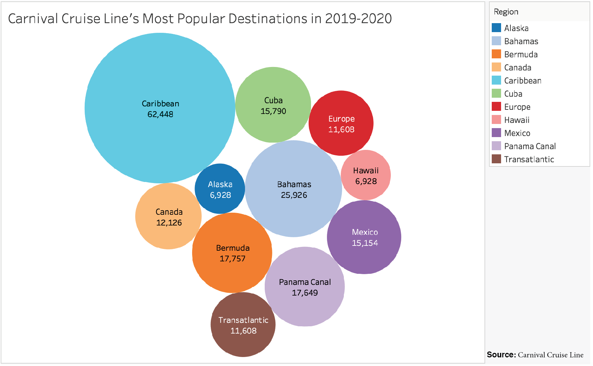

Cruise ship tourism is at an all-time-high, with an expected increase of 67% of overall cruise line passengers from 2009 to 2019. Most ships can carry up to 5,000 passengers  for days at a time, providing them with everything they could possibly need. With swimming pools, restaurants, shops, gyms, saunas, casinos, laundry rooms and thousands of living quarters, these vessels are practically floating cities that come with hidden environmental costs.

The amount of fuel from one ship could fill 12,000 cars, according to Oceana . This means the 24-hour energy needed to sustain such a large vessel causes a non-stop transmission of harmful pollutants into the air, which can contain sulfur dioxide and nitrogen oxides, which are principal components of acid rain. The fuel causing these transmissions is 50 times more harmful than regular fuel when burned .. If inhaled in excess it could even lead to brain tumors and diseases like Alzheimer’s . Many cruise passengers are unaware they are breathing in toxic particles equivalent to those in busy cities. 

But air pollution is not the only problem, and humans are not the only ones affected.

More than 1,000 tons of waste are generated each day on these vessels. The ships’ wastes range from sewage from toilets, sinks, showers, kitchens, laundry machines; paired with oily fluids, lubricants, grease, cleaning fluids, garbage and solid wastes . Ships can legally dump all of these into the ocean as long as it’s done more than four miles away from a coast. 

“The amount of sewage that gets dumped is staggering. It’s really, really crazy because of the concentration of the people on those ships. Even if the sewage is being dumped a few miles off shore, that is still definitely going to come into the coast and affect marine life. It’s not that far,” said Dr. Jesse Meiller, marine ecologist and environmental toxicologist. 

With a combination of air and waste pollution from cruise ships, marine life is impacted in several ways. According to Dr. Meiller, particles from the fuel exhaust settle on the water surface and can either float or end up in the bottom sediments. Some of the finer ones can dissolve in the water and be taken in by any fish or filter feeders. The problem is that many of the components of fossil fuels are persistent organic pollutants, meaning they don’t break down easily. Then they start to bio accumulate, where organisms take in a chemical and build it up in their systems.

“Not all chemicals bio accumulate, but many of those from fossil fuels, like the ones from cruise ships, do. Orcas are going to eat a whole bunch of seals, and if those seals have eaten fish which have also eaten a lot of krill, by the time they build up to the orcas, they have high levels of pollutants in their systems,” said Dr. Meiller. 

In contrast to air particles, wastes that are dumped into the ocean can have much heavier and quicker impacts on shallow water ecosystems. When sewage is thrown overboard a lot of nutrients go into the water, which can cause algae to grow. This is harmful because algae do not live long and usually grow on the surface of the water. If they grow in really dense communities they can block the sunlight to the bottom, keeping other plants from growing down low and making it hard for organisms to live under water without oxygen. 

Based on the amount of annual voyages made by some of the top seven cruise lines, the Caribbean is the most visited region in the world. With almost 700 voyages offered in 2019 to 2020, it is being visited by over 400 vessels that carry a total of more than 1.2 million passengers (only including these 7 cruise lines). This may suggest that this oceanic area is most exposed to pollution generated by cruise ships.

If waste is dumped in the middle of the ocean, it’s not going to be as much of an issue for marine ecosystems. But illegal dumping does happen too.

“There have been ships in the past that have been fined for dumping water contaminated with suds and that could be really really bad. Cruise lines, like Carnival, have been fined for dumping everything from used mattresses to other garbage in the ocean,” said Dr. Kiho Kim, marine ecologist and Executive Director for the Center for Teaching, Research and Learning (CTRL) at American University. 

Based on Carnival Cruise Line’s voyages in 2019 leading into 2020, about 60,000 passengers sail with them to the Caribbean, followed by about 25,000 to the Bahamas. These areas face large amounts of tourism and are more prone to the affects of waste pollution.

After Carnival Cruise Line got in trouble for violating ocean regulations in 2013, they began a five-year Environmental Compliance Plan (ECP), requiring third-party audits and court-appointed oversight . On their website they even say, “The health and vitality of the oceans, seas, and communities through which we travel is absolutely essential to our business. That makes protecting the environment and biodiversity one of our most critical areas of focus.” 

Although Dr.Kim said he doesn’t think illegal waste dumping is a frequent threat to the oceans, he said one of the biggest ways he thinks ships affect marine life is through sound. 

“These ships make a lot of noise. You may not hear it because you are insulted in a cabin above the engine. But if you are a marine creature that depends on sound for communication, navigation or getting a sense of the environment, the noise can be literally deafening,” said Dr. Kim. 

So why are people not paying attention? To me, it seemed like these impacts were clear indicators of contaminated oceans, physical destruction of natural environments and a lack of adequate legislation to protect the ocean. 

“The reason why we don’t worry so much about ecosystems along the coast of the United States, for example, is because they have already been damaged. Even in the Caribbean coral reefs have declined significantly over the last 50 to 60 years. That’s in part because of climate change, but largely because of human exploitation, like the dumping of sewage. They are seeing big impacts of human encroachment,” said Dr. Kim.

Another point to consider is the complication of dealing with rules in international waters. Most of the ocean is not governed by any one country. While we have treaties and agreements that all entities are supposed to abide by, no one is actually policing or overseeing those waters, and no one is really funding it anyway. Dr. Meiller described it as a “no man’s land.” “It’s such a complicated issue that people don’t want to tackle it. They want to tackle something that is more concrete and discreet that they can actually handle,” she said.

